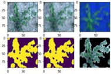
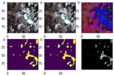
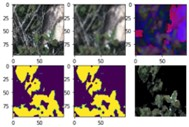

# Artificial Neural Network and Deep Learning - Challenge 1"
### Authors: Flavio Renzi, Jaskaran Singh, Francesco Grilli
---

## Approach

We started this first challenge together to have a basic understanding
of the tools we could use. When we saw the dataset for the first time we
immediately noticed that some classes (1st and 6th) were very unbalanced
between the others with a ratio of 1:2.7. The majority of the classes
could count on several images around 500, so not much data was available
for the training. Also, the quality of the images (96x96 pixels) was not
very good. We immediately decided to apply some preprocessing stages to
our dataset to uniformize the number of images per class and reduce the
unbalancing. We have also divided our dataset into three folders
(training, validation and testing) to train the model on the training
images and check the quality of training over the validation images. The
test set was only used at the end of each model to assess the accuracy
and compare the quality between different models. To avoid overfitting
we have used different techniques. Since we applied oversampling to
increase the number of training images, we have also applied a strong
data augmentation over the training images on each batch of a different
epoch. Looking at the photos already present in the dataset we first
decided to apply zoom and rotation since the images were specially made
for this kind of transformation, and then we also added shifting and
brightness (since some images were dark and with shadows). This brought
us better results and a lower discrepancy between training and
validation accuracy. Other techniques used for not overfitting were
adding the early stopping with a different patience value and a dropout
layer with small values (0.1/0.3). To assess the quality of our model we
have also used some metrics such as accuracy, recall and loss. All these
metrics were measured and averaged between all classes so we also used
the confusion matrix to assess the quality of each class. We have
understood that the worst accuracy was performed on the 1st class and
the 6th, as we could easily expect due to the limited number of images
available. A more sophisticated preprocess stage in which we tried to
improve the performance was by using the OpenCV library that extracted
the plant seedling using only an HSV filter and removed the background
noise. Even if we could extract very clear images, we didn't achieve
great results. Starting from these basic techniques we have then
developed more advanced ones for improving the preprocessing and the
unbalancing of the classes with an overall improvement of the model
accuracy. We started the challenge together with a simple network based
on VGG16 to try and understand the submission mechanism. At this point,
we brainstormed to think of different approaches to face the challenge
and we divided the work. Working in parallel allowed us to try different
networks and different techniques to solve the classification problem.

### Network from scratch

We start our experiment with different architectures trying to
understand how the information is being processed inside the network. In
the end, we have done an architecture composed of blocks of filters
doubling in depth going in the output direction and interleaving those
blocks with an activation layer using ReLU. Experimenting with this
network we noticed an interesting property that can help us reduce the
number of parameters without changing the network power: the max pooling
layer is a max operator between a matrix of input so the max of the
output of a monotonic function, in this case, the ReLU, is the function
of the max. We used the ReLu layers to add non-linearity and increase
the power of the network to represent the information in a more complex
way. Going in the output direction we decrease the dimension of a layer
but we increase the channel number. In this way, we keep a big receptive
field using fewer parameters. With this network, we obtain 0.79 in
accuracy on the local test set. The result wasn't insignificant
considering that we had a small dataset but we certainly knew that the
key was to use transfer learning to start with a pre-trained CNN and
only add the output part.

### VGG16

VGG16 is a very famous CNN used for transfer learning. The fundamental
idea is similar to our approach when we build our network from scratch.
Use a sequence of blocks of filters increasing in depth to expand the
output receptive field. Those blocks are interleaved with a Max Pooling
layer of 2x2 to reduce the layer size going down the network. In our
experiment we instantly noticed that, as we expected, increasing the
number of dense layers in output led quickly to overfitting, having a
training accuracy skyrocket to 0.95+ and the validation accuracy
remaining low around 0.60. We settle on just one dense layer followed by
the output layer with a softmax activation function and we start working
on the data with oversampling and aggressive data augmentation without
success. We also applied fine-tuning by trying different numbers of
layers to unlock during this phase, understanding that with a dataset
where the features are really difficult to find it is better to unlock
almost the whole network and use a slow learning rate. The best result
we had with this network was with a basic augmentation and oversampling
just to balance the classes and pushing a little bit the dropout after
the CNN with an accuracy of 0.83 in our local test and a 0.81 when
submitted on Codalab.

### ResNet

The main idea of moving from the most regular VGG16 network to the
ResNet was to use a smaller network, less number of filters and with
fewer parameters. The characteristics of this network are the "shortcut
connections" between different blocks of convolutional layers. Also,
ResNet uses a bottleneck design for the building block that reduces the
number of parameters and the number of multiplications, making the
training of the network faster. This feature and the fact that the
network has fewer parameters allowed us to fine-tune the entire network,
not overfit and achieve good results. After many trials, in fact, we
have achieved the best result using basic augmentation and balancing the
classes with an accuracy of 0.83 on our local test and 0.79 on the
Codalab hidden tests. The worst classes still remained the 1st and the
6th with an accuracy of around 0.6.

### EfficentNet

This is the biggest network we tried. It is a very versatile network
existing in various versions because the core principle is that it can
uniformly scale to a different width, depth or resolution based on a
coefficient. The ability to scale means that it can be used in different
types of hardware without the need for a powerful GPU if needed. The
smaller version of it is based on MobileNetV2 which also uses the
concept of shortcuts similar to ResNet. Given the dimension of the
network, we didn\'t do anything fancy with the output layers.

We tested different numbers of layers to unlock during the fine tuning
phase and we observed that unlocking more than half of the network was
pretty useless and led to overfitting. In the end, we obtained an
accuracy of around 0.80 on our local test and we see little to no
difference despite our changes and efforts.

### XceptionNet

XceptionNet was born as the evolution of InceptionNet. It differs from
the other network we have tried because it introduces a new type of
layer called Depthwise Separable Convolution which first applies the
spatial convolution to each channel and then a pointwise convolution to
obtain the result. It differs from the standard convolution because we
don\'t need to compute the filter across all input channels, reducing
the number of parameters used.

The main difference with respect to the InceptionNet, apart from the
swap of the order between the depthwise convolution and the pointwise
convolution putting the last one before, is the absence of an
intermediate ReLu to add non-linearity. From our experiment, we obtain
the best result with a single big dense layer before the softmax. We
have tried different types of data augmentation but in the end, we have
used an aggressive dropout (0.4) to prevent overfitting. We didn\'t see
big evidence of overfitting so we decided to unlock the whole network
during the fine-tuning phase obtaining our best result with an accuracy
of 0.89 in our local tests and 0.87 when submitted on Codalab.

## Major failures (and what we learned from them)

### HSV filtering

As said before, one technique we have implemented for preprocessing our
dataset was to extract the plant seedling only and remove the background
that we have considered noise. In this way, we have obtained images with
very clear plants on a black background. The technique was based on HSV
values, keeping only green HSV and removing the rest. The final result
were images with very clear plant seedlings in the foreground but with a
very portion of the plants, the main part of the images were black and
classified as noise. The results of this preprocessing were bad, with an
accuracy of 0.4.

|  |  |  |
| --- | --- |--- |

Output of each layer of the HSV filter implemented
(Input image, gaussian blur, HSV map, generated mask, boolean mask,
output image)

As we can see from these examples, sometimes, this method works really
well but, in other cases, it generates an almost black image so we
thought that the problem was that the filtering was too aggressive, it
removed too much from the images. Also, we thought that our model could
not extract features with black portions of images that were not all in
the same place, but changed position every time.

An idea we had is to use this filter as part of the network to add a
fourth channel to the input with the mask so that the network can figure
out by itself when to use the mask and when to discard it. We tried to
implement this method, but after a lot of work, we couldn't finish it in
time for the end of the project.

### Class 1 vs the World

Looking at the result we had with the traditional convolutional network,
it was clear that we were struggling in the first class, the one where
we had the least data.

To try to overcome this issue we decided to create a classifier that can
distinguish only the first class from the others. Our idea was that in
this way the network doesn't have to learn what is class 1, but actually
what it isn't. In this way, we can use a lot of data from the other
classes to do this. We learned the hard way that this was a terrible
idea because we actually accentuate the problem of the unbalanced
classes so much that also the oversampling cannot keep up with it. This
idea was not discarded entirely because in our best network we revised
this method to work in combination with other networks.

## Best Result

At the end of the competition we had a model based on XceptionNet that
scored 0.87 in accuracy on Codalab, but we know that the results on the
first species were what held us from achieving better results.

We had already tried different methods of augmentation and other
techniques to improve our results in that class but when we had a model
that performed well in that class, it was terrible in the others.

to take the best of both worlds we use a technique called ensemble
method to join two or more models together. We started training a model
doubling the weight of the first class to make it worth more than the
others. Then at first we just run the 2 models in parallel and at the
end, we take the more confident class from the two and we use it as
output. In this way, we achieved a little improvement so we tried
combining the 2 networks with a simple softmax layer. This led us to our
best results, with an improvement on the single models of 2 percentage
points in the overall accuracy and almost 12 percentage points in the
score of the first class. At the end of the competition, with this
method, we reach an accuracy of 0.887 in the final hidden test. Overall,
we are very pleased with the results of our competition entry. We
believe that our approach of using an ensemble of two different models
was key to our success. We believe that there is still room for
improvement and for learning.
