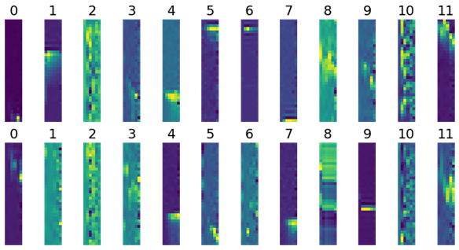

# Artificial Neural Network and Deep Learning - Challenge 2
### Authors: Flavio Renzi, Jaskaran Singh, Francesco Grilli, Stefano Vighini

## Approach

We started this second challenge by inspecting the dataset and trying to
understand the meaning of the features we had. This second challenge was
based on time series and we noticed that the dataset was structured with
a window of 36 elements with 6 features each. At first, we preprocessed
our dataset by scaling all elements by features with a MinMaxScaler
between -1 and 1 (or 0 and 1). We tried to normalize by considering the
windows altogether, but the results didn't turn out to be nice with
1DCNN so, in the end, we chose to normalize window by window. We have
also split our dataset into training and validation in order to measure
the performance of the model over the validation set. Then we tried to
build a very simple 1DCNN model based on the techniques we have seen in
class and by tuning the number of layers and neurons. Between each
layer, we have also added some dropout layers to reduce overfitting and
improve the accuracy of the validation data. The first result we
obtained was an accuracy of 0.59. We have noticed that some classes
obtained very poor scores over the validation set and others very high
scores (around 0.95) instead. We knew that it could be improved by using
more complex models and finer preprocessing so we worked in parallel in
order to explore very different techniques.

### Preprocessing

We tried changing the window from 36 to 108 joining 3 of the given
window together to see whether the model would be able to learn more
difficult patterns and trying to understand if the given window size
were optimal. During this process, we had to make the assumption of the
data being continuous, even though it was not probable. Different
approaches have been tried: replicating 3 times the same window;
concatenating different windows (with stride = 1 window and the last
windows being merged with the previous ones, to keep unchanged the
number of samples). The first approach achieved worse results, and the
second one was unfeasible to submit as we didn't know the labels of the
test data and we couldn't concatenate windows as it was not guaranteed
that the larger window would be made of smaller ones belonging to the
same class.

Other experiments were made trying to interpolate the data using a
spline to generate more samples in a single window. The idea was that
maybe the data come from a smooth system and it is sampled with a low
rate, so by interpolating them we can compute an estimation of the
missing data and doing so, have a better understanding of the system
evolution.

Another approach that we tried to preprocess and augment the data was
something similar to CutMix. We implemented an algorithm that generates
new samples of a class taking random cuts from two windows of the same
class. To further improve the performance we decided to randomly pick
the class to generate the new sample using a distribution based on the
number of elements each class has so that we generate more samples for
the classes with less data trying to balance them.

### 1D Convolution

At the start of the competition, we decided to experiment a lot with the
data, and how to preprocess and augment them as we discussed before. To
do that we decided to use a simple network with 3 convolutional 1D
layers and a simple dense before the output softmax. This gives us good
enough results to start reasoning on the problem and understand the
dataset better. We also tried different configurations changing the
number of filters, layers and kernel size to improve our result.

### LSTM & BiLSTM Network

We have also attempted to use Long Short Term Memory and also
Bidirectional LSTM for extracting information from the time series.
After tuning the number of layers and the neurons we have reached a
maximum accuracy over the validation set of just 0.59 for the LSTM and
0.49 with BiLSTM, not enough to move in this direction and explore new
strategies with these layers.

### Transformer Network

We have tried the transformer architecture, the architecture is taken
from “Attention is all you need”.  
The transformer architecture consists of a series of encoder and decoder
layers, each of which is made up of a self-attention module and a
feedforward neural network. The self-attention module allows each
element in the input sequence to attend to all other elements, weighting
their importance and computing a weighted sum of the input features. The
feedforward neural network processes the weighted sum and produces an
output. While the transformer was originally designed for natural
language processing tasks, it can also be applied to other types of
sequential data, including time series. One way to use a transformer for
time series classification is to treat each time step in the series as
an element in a sequence and apply the transformer architecture to
process the sequence. The results we obtained were not so relevant so we
decided to not continue experimenting with this model.

### AutoEncoder

The first time we inspected the dataset we noticed that it was very
unbalanced, there were classes with very low samples. In order to add
more samples to the dataset we decided to try the path of the
Autoencoder. With the Autoencoder model, we extract some features from
the samples and map them in a lower dimensional space using an Encoder.
Then we use the Decoder to re-map the lower dimensional information to
the original sample. When the network is trained we can remove the
Encoder and leave just the Decoder and use it to generate some new
samples by giving some samples taken from the latent space where all the
samples of the dataset leave. As an experiment, we started by using only
class number 9, the class with more samples, to understand if it could
be possible to use this kind of model. To assess the quality of the
model we used MSE and the MAE. In the end, we reconstructed the original
dataset and compared the generated samples and the real ones, noticing
that the variation was significant and could not be used to generate new
coherent samples.

### ResNetStyle models

We have built a ResNet-style model from scratch with a few layers and
parameters changing the normal layers with LSTM layers in order to
manage the time series. The input was a window with 36 elements and 6
features each without resizing it. When we saw the performances were bad
we moved to the real ResNet model loaded directly from Keras. The main
problem was the input shape that was different from the one we had, so
we needed to first resize the input into a 36x36 grey-scale image and
then we triplicated the grey-scale layer in order to obtain an image of
36x36x3 (with 3 channel RGB all equals). In the end, we managed to use
the ResNet model with and without the pre-trained weight over the
“imagenet” dataset. The performances of the overall models were around
0.65 on the validation dataset so we didn’t think it was suitable to
upload the model on the Codalab hidden tests

### Model from Scratch 2D CNN

Plotting the data with imshow we noticed some patterns seemed to be
shared across different data taken from the same class so we started
experimenting with the usual technique to approach an image
classification. Because the spatial filter used in CNNs is squared we
decided to use a resizing layer in order to create 36x36 images. In this
way, the filter can work in a wider space without using padding. To
preprocess the data we first use a RobustScaler to normalize over an
entire window and then we apply some soft data augmentation to limit the
overfitting of the model. Reasoning on the data we decided to use only
the vertical flip and shift to not destroy the concept of time series.

### K-Fold & Ensemble

This is the best model we have obtained over all other methods we have
tried. We have decided to try K-fold over the entire dataset with K=8
partitions. Then we built 8 models with a very simple (but effective)
structure made of some 2D Convolutional layers and one final dense
layer. Each model reached an accuracy over the validation set of around
0.7+. This method of training different models on a different split
dataset allows us to train each model at its best, keeping the early
stopping to limit the overfitting. In the end, we merged those 8 models
in parallels using a concatenate layer and put two dense layers as
output. In order to fit this last model we have locked the training of
the 8 simple models and fit over the entire dataset with only the last
two dense layers. In the end, we tested the overall model on the Codalab
hidden test and we reached an accuracy of 0.727, the highest score from
our models.

## Conclusion

In conclusion, the 2D CNN model proved to be the most effective method
for analyzing time series data in this experiment. We also tried using
the typical CNN for image classification so we built some models with
VGG16 and Xcepion but we obtained bad results. Reasoning on that we
arrive at the conclusion that maybe the big networks are not usable on a
small dataset with small images like ours. Using K-fold with 8
partitions with a simple CNN network allowed us to train multiple models
with high accuracy, and combining them in parallel with some additional
dense layers resulted in an overall model with an accuracy of 0.727 on
the hidden test set. This highlights the potential of using 2D CNNs for
analyzing time series data and the benefits of using K-fold
cross-validation and model ensembling techniques.
