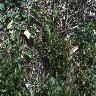

# ANNDL2022-23
This repository contains the code for reproducing the models built for solving the challenges of the Artificial Neural Network &amp; Deep Learning Course of Politecnico di Milano

# Challenge 1
The first challenge was an image classification problem. 

The dataset given is composed of 8 different species of plants which must be correctly classified. 
The dataset is clearly unbalanced with fewer images for species 1 and 8. In the folder Chellenge 1/Final you can read the report with all techniques we have used to address the problem.

